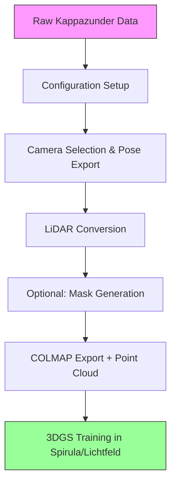

# Pipeline Overview

Understanding how the components work together to transform raw Kappazunder data into 3DGS-ready assets.

## End-to-End Workflow



### Step-by-Step Breakdown

#### 1. Configuration Setup
- User defines ROI polygon in EPSG:31256 coordinates
- Sets data paths and processing parameters in YAML config
- Organizes raw data in expected directory structure

#### 2. Camera Selection & Pose Export (`build_colmap_selection.py`)
**Input**: Kappazunder image metadata + ROI polygon  
**Process**:
1. Load trajectory/sensor metadata and image poses
2. Convert vehicle-centric poses to world coordinates
3. Compute camera frustums (pyramids representing what each camera sees)
4. Test frustum-ROI intersection for each image
5. Select images where frustum overlaps ROI; this results in a selection such as this: <br>

6. Optionally copy/rename selected images to sequential naming
7. Export to COLMAP text format (cameras.txt, images.txt, points3D.txt)
8. Write scene origin offset for coordinate alignment

**Output**: 
<!-- - `datasets/<scene_name>/images/frame_######.jpg` (selected images)
- `datasets/<scene_name>/sparse/0/{cameras.txt,images.txt,points3D.txt}`
- `datasets/<scene_name>/scene_origin.txt` -->
```
datasets/<scene_name>/
├── images/                 # Selected images (renamed)
│   └── frame_######.jpg
├── sparse/0/               # COLMAP export
│   ├── cameras.txt
│   ├── images.txt
│   └── points3D.txt
└── scene_origin.txt        # Offset for coordinate alignment
```

#### 3. LiDAR Conversion (`laz_to_ply.py`)
**Input**: Raw LAZ LiDAR files + scene_origin.txt  
**Process**:
1. Load and merge LAZ files from selected trajectories
2. Apply voxel downsampling (configurable voxel_size)
3. Apply same scene origin offset as used for cameras
4. Convert LAZ to PLY format preserving XYZ coordinates

{}
Adapt the voxel size such that 10-50% of the total Gaussian count is initilized from the LiDAR point cloud.
{}

**Output**: 
<!-- - `datasets/<scene_name>/sparse/0/points3D_init.ply` -->
```
datasets/<scene_name>/
└── sparse/0/
	└── points3D_init.ply     # Aligned point cloud for 3DGS initialization
```

#### 4. Optional Mask Generation (`yolo_segmentation/`)
**Input**: Selected images + (optionally) manual masks 
**Process**:
1. Generate segmentation masks using YOLO/SAM (manually or via notebooks)
2. Convert polygon masks to YOLO format for training
3. Split dataset into train/val sets
4. Produce data.yaml and labeled images

**Output**:
- `yolo_finetune_images/data.yaml` (YOLO config)
- `yolo_finetune_images/images/` and `labels/`
- Binary mask images for use in 3DGS training

#### 5. 3DGS Training
**Input**: COLMAP export + (optional) masks, point cloud
**Process** (in Spirula/Lichtfeld Studio):
1. Import COLMAP project (cameras, images, initial point cloud)
2. Optionally provide masks for dynamic object removal
3. Initialize 3D Gaussians from points3D_init.ply (recommended) or random
4. Run optimization
5. Render novel views and compare with input images
6. Iterate until convergence

**Output**: Trained 3DGS model (.ply or .ckpt format) viewable in real-time

## Coordinate System Handling

The pipeline carefully manages coordinate transformations:

1. **Kappazunder Native**: EPSG:31256 (meters, MGI/Austria GK East) + vehicle-centric rotations
2. **World Frame**: Same EPSG:31256 but with rotations applied to make +Z up, +Y forward
3. **COLMAP Expects**: World-to-camera rotation quaternions + translation vectors
4. **Internal Consistency**: scene_origin.txt ensures cameras and LiDAR share same offset

Key transformations happen in:
- `rotation_conversion.py`: Converts Kappazunder (\omega,\phi,\kappa) to COLMAP (qw,qx,qy,qz,tx,ty,tz)
- Config parameters `invert_y_axis` and `invert_z_axis`: Handle coordinate system differences
- `scene_origin.txt`: Single offset applied to both cameras and point cloud

## Quality Checks

At each stage, verify:

**After Camera Selection**:
- Visual inspection: Do selected images actually cover your ROI?
- Count check: Reasonable number of images for area size (~10-50 per city block)
- Pose sanity: No extreme jumps in camera positions

**After LiDAR Conversion**:
- Point cloud density: Reasonable spacing for your voxel size
- Alignment: Points should align with visible geometry in images
- Extents: Bounding box should roughly match your ROI

**Before 3DGS Training**:
- Image/Camera count match: Same number of images as pose entries
- Initialization overlap: points3D_init.ply should overlap with camera views
- Scale consistency: Scene dimensions should match real-world expectations

## Next Steps

- [Camera Selection Details](./camera-selection) — deep dive into frustum calculation and filtering
- [LiDAR Processing Details](./lidar-conversion) — voxelization and coordinate alignment
- [Masking Guide](./masking) — removing dynamic objects for cleaner reconstructions
- [Configuration Reference](./configuration) — detailed explanation of all config parameters